### 线程束分支

```
__global__ void mathKernel(float *c)
{
    int tid = blockIdx.x * blockDim.x + threadIdx.x;
    float ia, ib;
    ia = ib = 0.0f;
    if (tid % 2 == 0)
    {
        ia = 100.0f;
    }
    else
    {
        ib = 200.0f;
    }
    c[tid] = ia + ib;
}
```

**分支特点：** warp 分支只会发生在统一 warp 内


解决方案：
1. 如果分支代码较简单，则编译器会通过指令预测来优化

2. 模拟指令预测优化：

```
__global__ void mathKernel(float *c)
{
    int tid = blockIdx.x * blockDim.x + threadIdx.x;
    float ia, ib;
    ia = ib = 0.0f;

    bool ipred = (tid % 2 == 0);    // 模拟 nvcc 编译时对 warp 分支优化


    if (ipred)
    {
        ia = 100.0f;
    }
    if (!ipred)
    {
        ib = 200.0f;
    }
    c[tid] = ia + ib;
}
```

3. 以线程束为基本单元访问

    如果代码中的条件判断值与线程 id 关联，则以线程束为基本单元访问数

### 邻域并行计算

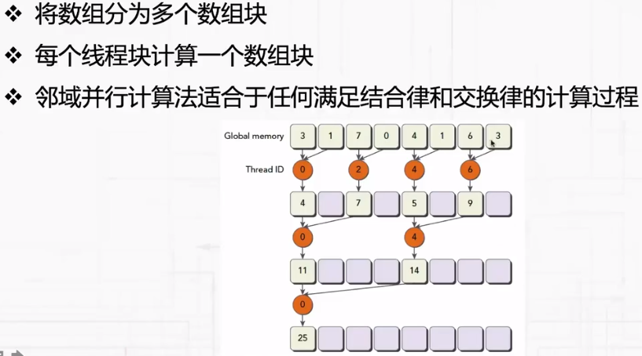

### 间域并行计算

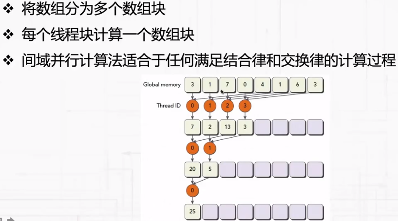

### 循环展开

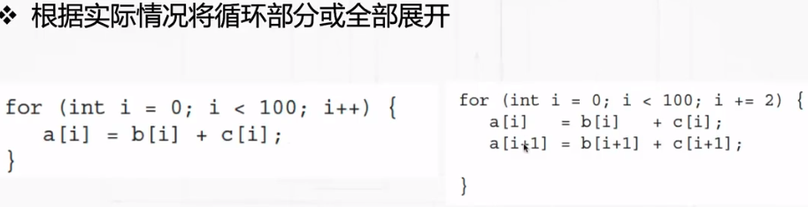

### 动态并行

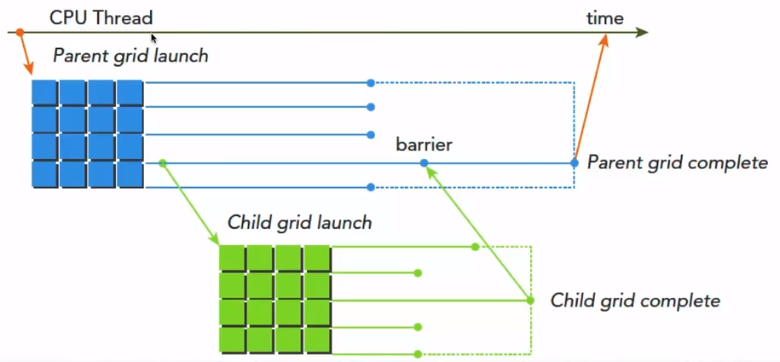

### 寄存器溢出

概念：内核函数使用的寄存器数量超过硬件限制时，数据会被保存到线程的本地内存（local mem）中。
影响：降低程序运行性能。
使用控制：

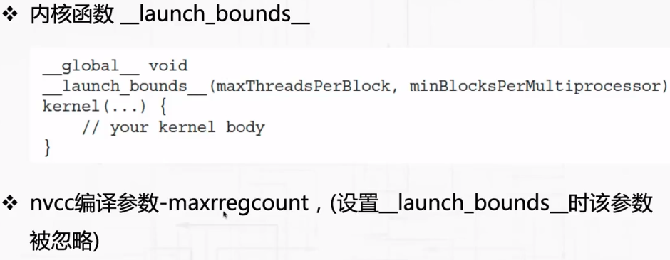

### 本地内存

* 本地内存由每个线程独有，延迟比寄存器大
* 寄存器溢出时数据会被保存到本地内存
* 内核编译时无法确定索引的数组保存在本地内存中
* 结构体和大数组保存在本地内存中
* 无法保存在寄存器中的其他数据

### 共享内存

* __shared__ 关键字修饰，低延迟、高带宽
* 共享内存可被线程快中的所有线程访问
* 共享内存具有与其线程快相同的生命周期
* 共享内存是一种线程间通信机制
* 对共享内存的访问必须要做同步处理，__syncthreads()
* 流处理器中的L1缓存和共享内存共享片上的64K存储区域

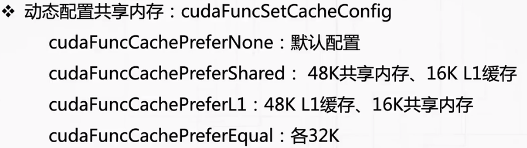

### 常量内存

* 64K
* 内核函数只能读取常量内存中的数据
* 必须要在主机程序中初始化

### 全部内存

* 与程序具有相同的生命周期
* 首字节地址必须是32字节、64字节、128字节的整数倍
* 初始化：

    1. 使用__device__关键字静态生命全局内存

    2. 主机代码中使用cudaMalloc动态声明，cudaFree释放

### GPU缓存

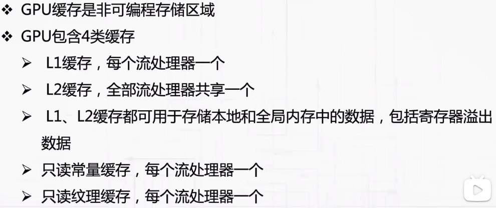

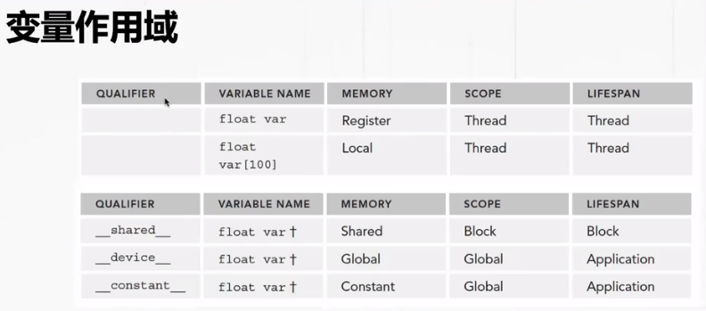

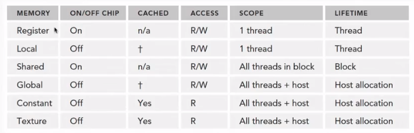

### 统一虚拟内存

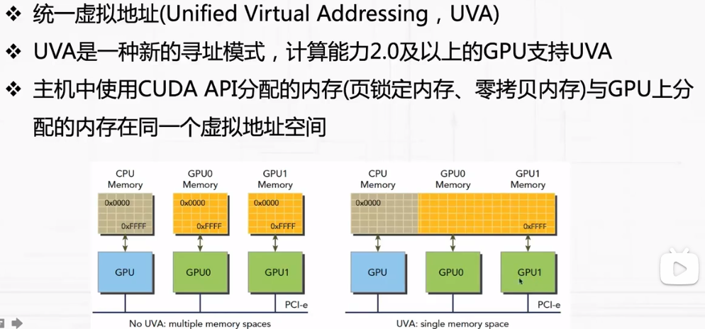

### 统一内存空间

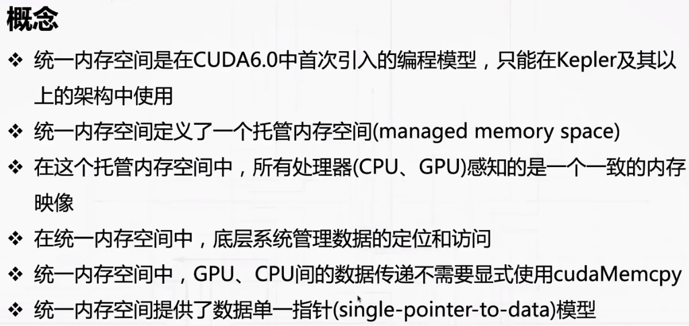

### 页锁定内存

    页锁定内存上的内容在CPU和GPU上均可访问

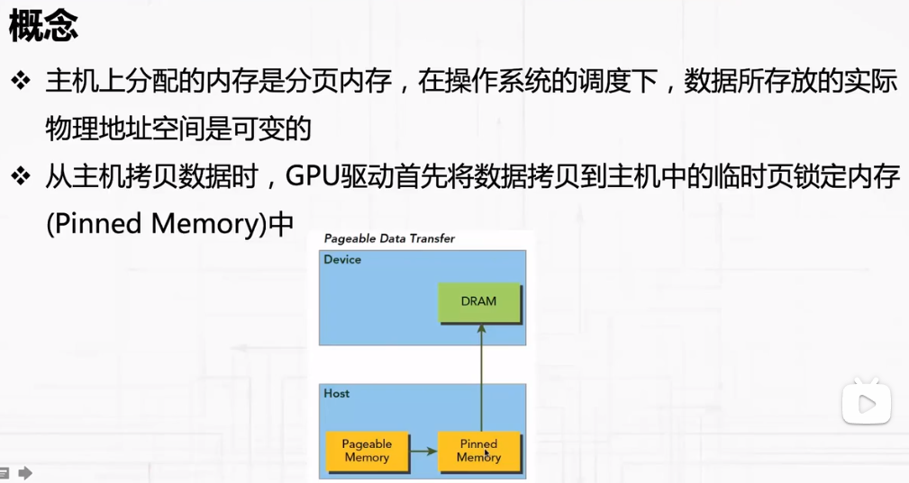
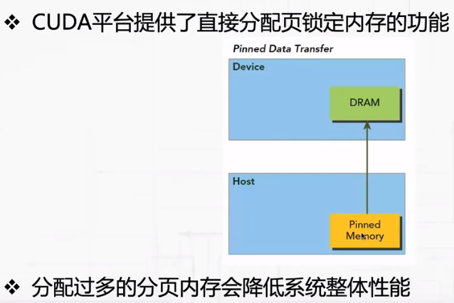

分配太多会导致系统运行空间变小

页锁定内存自动映射

### 零拷贝内存

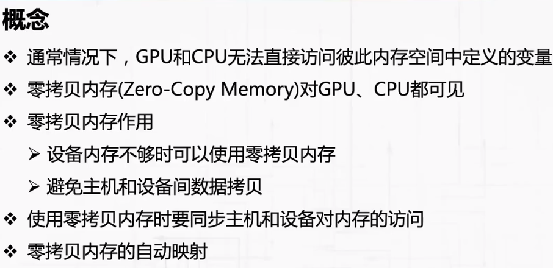

* 零拷贝内存分配： cudaHostAlloc()
* 零拷贝内存释放： cudaFreeHost()

### 内存加载

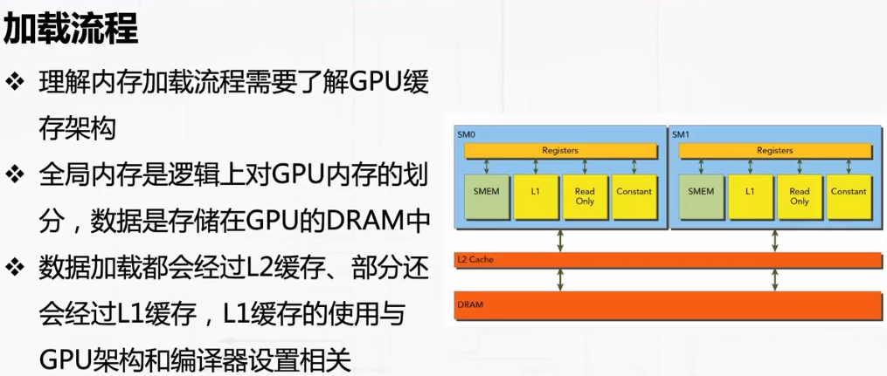

内核函数对内存数据加载的请求引发数据在DRAM和GPU片上存储间传递

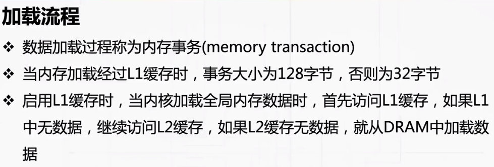


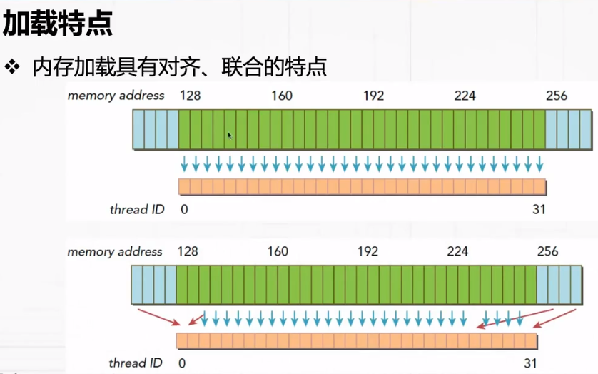


