### 线程束分支

```
__global__ void mathKernel(float *c)
{
    int tid = blockIdx.x * blockDim.x + threadIdx.x;
    float ia, ib;
    ia = ib = 0.0f;
    if (tid % 2 == 0)
    {
        ia = 100.0f;
    }
    else
    {
        ib = 200.0f;
    }
    c[tid] = ia + ib;
}
```

**分支特点：** warp 分支只会发生在同一 warp 内


解决方案：
1. 如果分支代码较简单，则编译器会通过指令预测来优化

2. 模拟指令预测优化：

```
__global__ void mathKernel(float *c)
{
    int tid = blockIdx.x * blockDim.x + threadIdx.x;
    float ia, ib;
    ia = ib = 0.0f;

    bool ipred = (tid % 2 == 0);    // 模拟 nvcc 编译时对 warp 分支优化


    if (ipred)
    {
        ia = 100.0f;
    }
    if (!ipred)
    {
        ib = 200.0f;
    }
    c[tid] = ia + ib;
}
```

3. 以线程束为基本单元访问

    如果代码中的条件判断值与线程 id 关联，则以线程束为基本单元访问数

### 邻域并行计算


### 间域并行计算


### 循环展开


### 动态并行


### 寄存器溢出

概念：内核函数使用的寄存器数量超过硬件限制时，数据会被保存到线程的本地内存（local mem）中。
影响：降低程序运行性能。
使用控制：


### 本地内存

* 本地内存由每个线程独有，延迟比寄存器大
* 寄存器溢出时数据会被保存到本地内存
* 内核编译时无法确定索引的数组保存在本地内存中
* 结构体和大数组保存在本地内存中
* 无法保存在寄存器中的其他数据

### 共享内存

* __shared__ 关键字修饰，低延迟、高带宽
* 共享内存可被线程快中的所有线程访问
* 共享内存具有与其线程块相同的生命周期
* 共享内存是一种线程间通信机制
* 对共享内存的访问必须要做同步处理，__syncthreads()
* 流处理器中的L1缓存和共享内存共享片上的64K存储区域


### 常量内存

* 64K
* 内核函数只能读取常量内存中的数据
* 必须要在主机程序中初始化

### 全局内存

* 与程序具有相同的生命周期
* 首字节地址必须是32字节、64字节、128字节的整数倍
* 初始化：

    1. 使用__device__关键字静态生命全局内存

    2. 主机代码中使用cudaMalloc动态声明，cudaFree释放

### GPU缓存


符号表示这个变量既可以保存数组，也可以保存标量


### 统一虚拟内存


### 统一内存空间


### 页锁定内存

    页锁定内存上的内容在CPU和GPU上均可访问


分配太多会导致系统运行空间变小

页锁定内存自动映射

### 零拷贝内存


* 零拷贝内存分配： cudaHostAlloc()
* 零拷贝内存释放： cudaFreeHost()

### 内存加载


内核函数对内存数据加载的请求引发数据在DRAM和GPU片上存储间传递


### 共享内存 bank

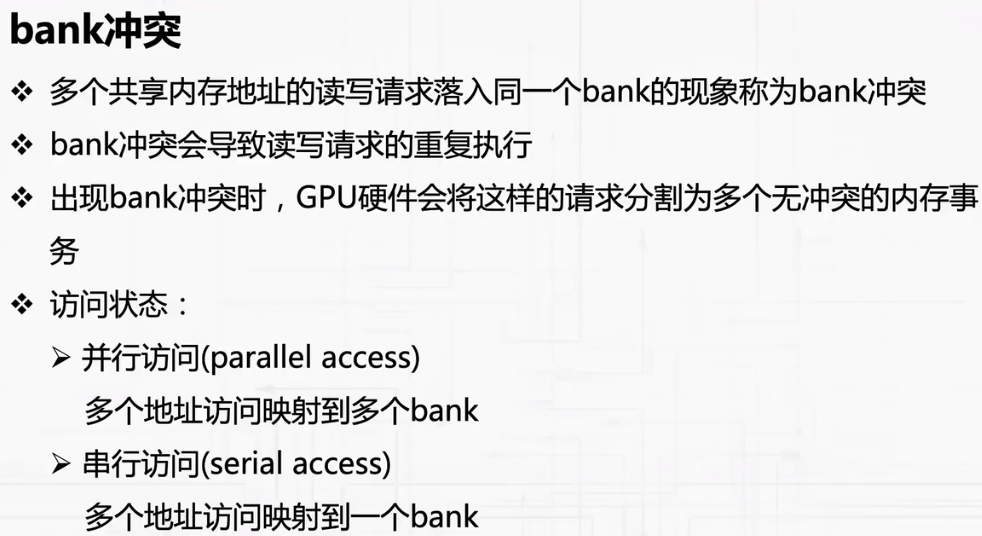


### 线程屏障 thread barrier

    保证线程块中所有线程必须都执行到某个特定点才能继续执行
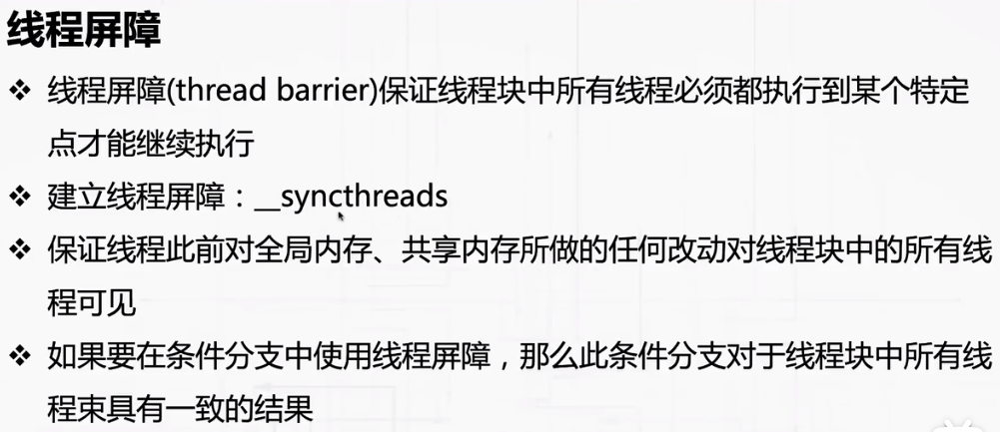

### 线程栅栏 thread fence

概念：内存栅栏（memory fence）保证在此之前写入内存的数据被所有线程可见

线程块栅栏作用于同一线程块，保证对共享内存、全局内存数据同步

__threadfence_block();

### 线程网格栅栏
（不能用于共享内存数据，只能用于全局内存数据）

范围：相同的线程网格

保证写入全局内存中的数据对网格中所有线程可见

__threadfence();

### shuffle 指令
* 使同一线程束中的线程可以直接交换数据
* 数据交换不依赖于共享内存或全局内存，延迟极低
* shuffle指令分为两类：用于整型数据、用于浮点型数据，每一类又包含四个指令
* lane代表线程束中的一个线程，索引范围为0~31

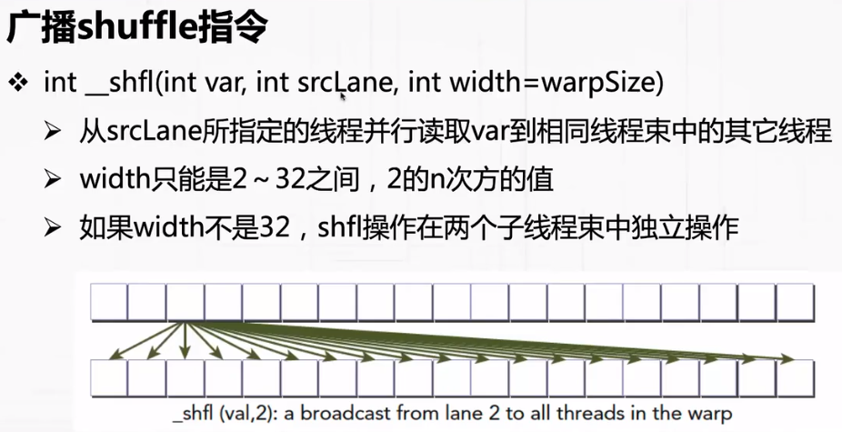

### 向上shuffle
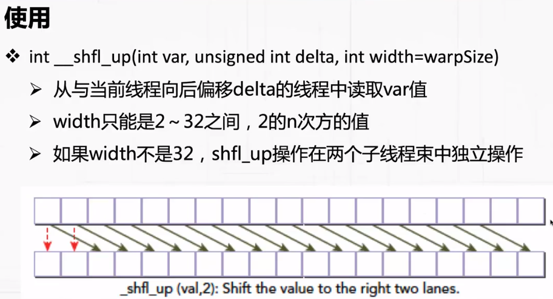

### 向后shuffle
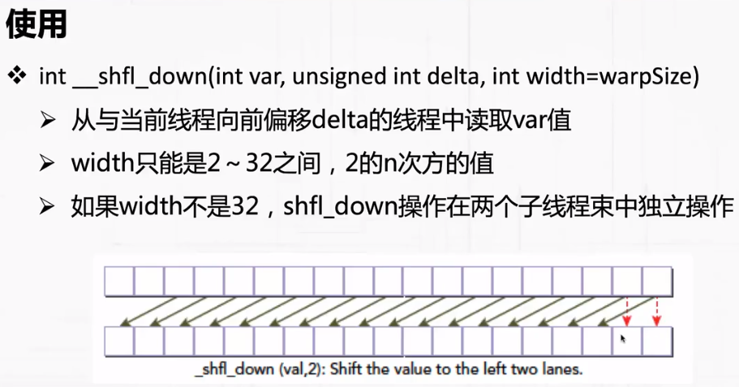

### 异或shuffle
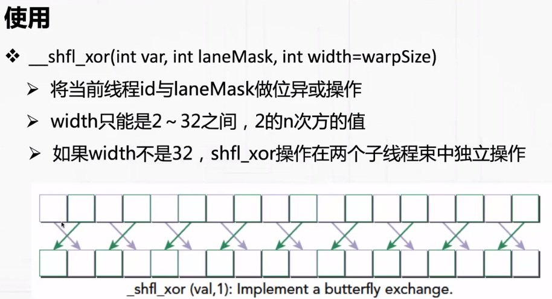

### CUDA流
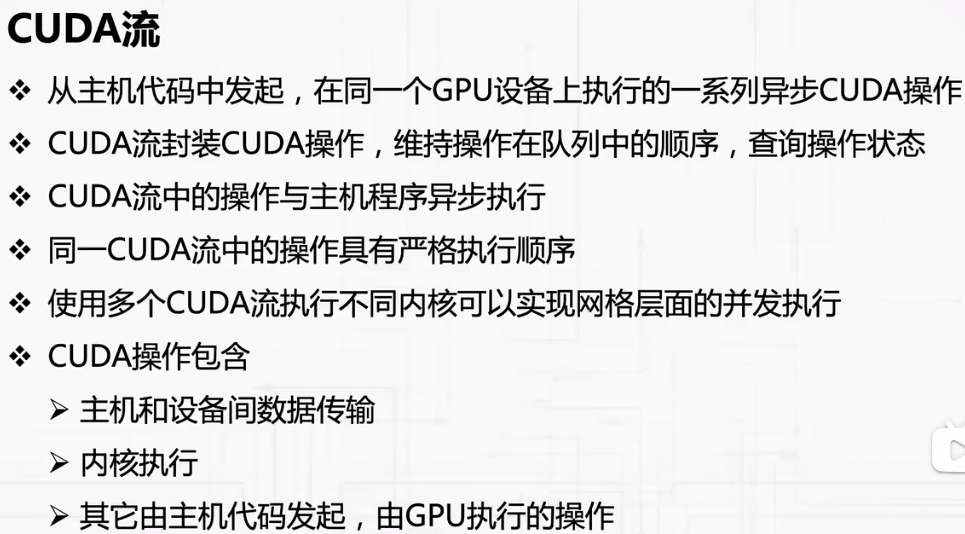
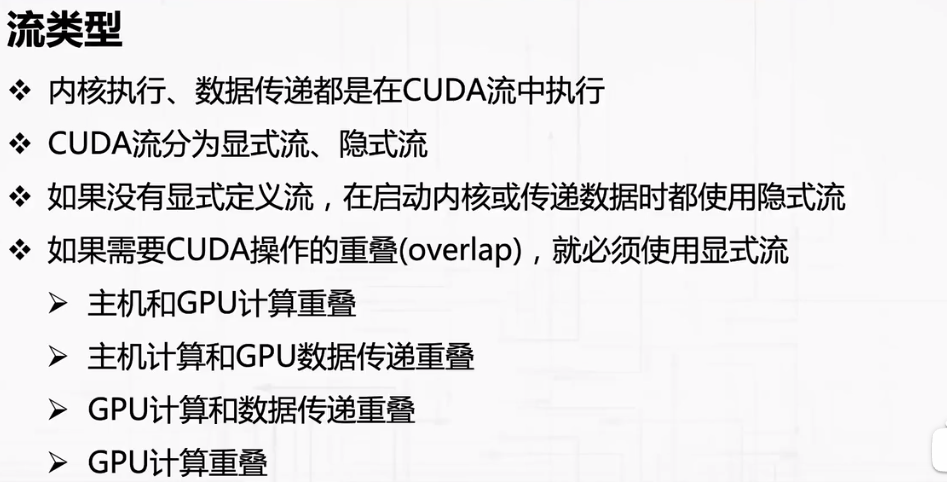
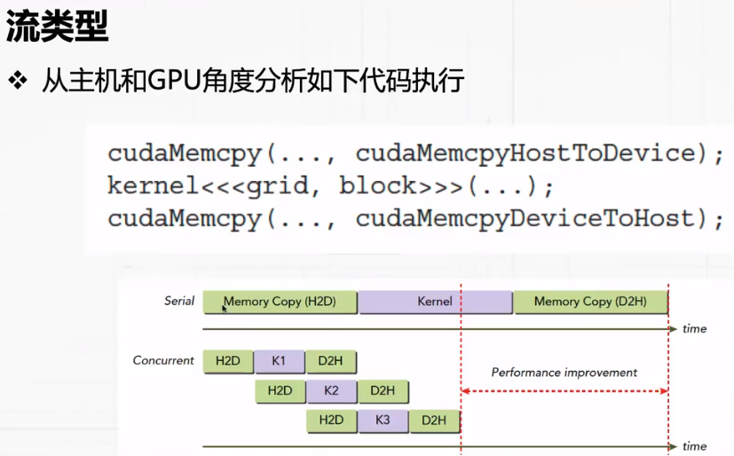

### 异步拷贝


### 流调度


### 流事件

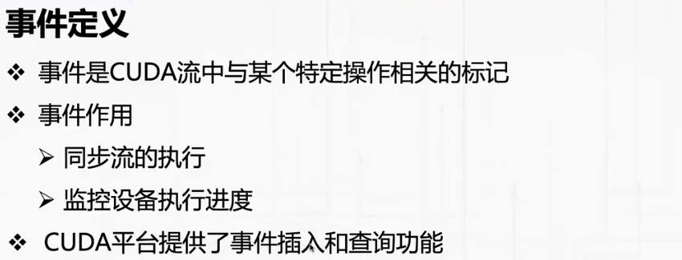

事件创建和销毁：
* 事件对象：cudaEvent_t
* 事件创建：cudaEventCreat
* 事件销毁：cudaEventDestory

### 流事件同步

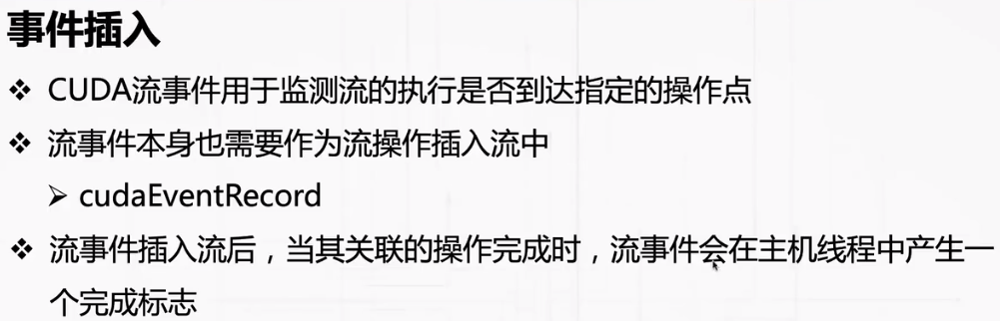


### 流操作时长计算
* 时长定义

    1. CUDA操作时长指CUDA流中完成某个操作所需时间
    2. CUDA操作时长可通过CUDA事件计算

* 计算方法

    1. 定义起、止两个CUDA事件
    2. 起、止事件可以分属不同的CUDA流

### 流执行顺序
* 隐式流和显示流顺序
    1. 除了内核执行外，隐式流中操作与主机线程同步（如cudaMemoryCopy函数）
    2. 显示流中的操作与主机线程异步
    3. 显示流可分为阻塞流和非阻塞流（阻塞与否：是否会被隐式流中的操作阻塞）
* 显示流控制
    1. 使用cudaStreamCreate创建的显示流都是阻塞流
    2. 非阻塞显示流创建：cudaStreamCreatWithFlags

### 隐式同步和显示同步

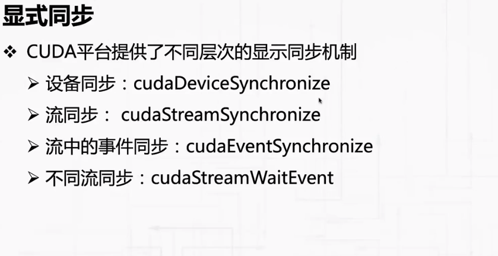

### 可配置事件
创建：cudaEventCreatWithFlags

可以在主机代码和内核函数中调用此接口

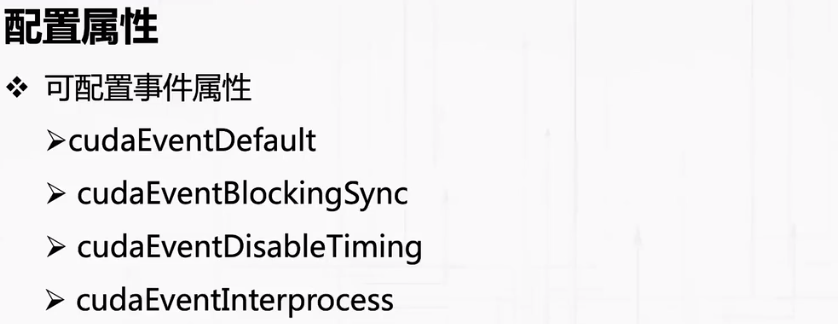

### 内核并发

* 在多个CUDA流中执行多个内核函数
* 执行内核的流可以是隐式流也可以是显示流

* 同一个核里面，CUDA操作是串行的
* 不同核之间的 CUDA操作是并行的

多流多内核执行方法：

* 创建多个显示流
* 将不同内核函数分发到不同的显示流执行

### OpenMP

* 用于CPU并行计算的编程模型
* 使用编译器指令设置需要并发执行的代码片段
* 并发性需要编译器支持
* 可提高CUDA程序中主机代码性能
* 使用：

    1. 添加头文件 omp.h
    2. 设置线程数量： omp_set_num_threads(3);
    3. 设置并行代码段
    ```
        #pragma omp parallel
        {
            std::cout << "thread is running\n" <<std::endl;
        }
    ```
    4. nvcc编译指令：nvcc -Xcomplier -fopenmp

### 流回调函数

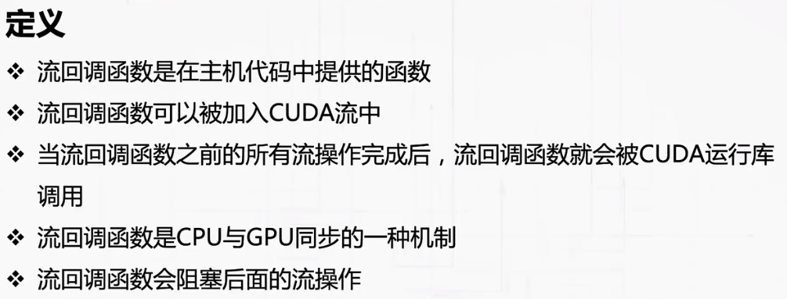
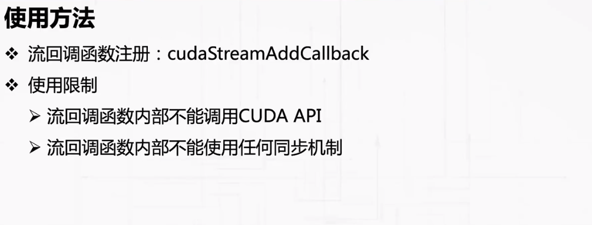

### 底层指令优化
概念

CUDA程序可分为两类，I/O限制（I/O-bound）和计算限制（compute-bound）

底层指令优化针对的是计算限制型

理解GPU底层指令在性能、数值精度、线程安全性等方面的优缺点对于优化CUDA程序非常重要

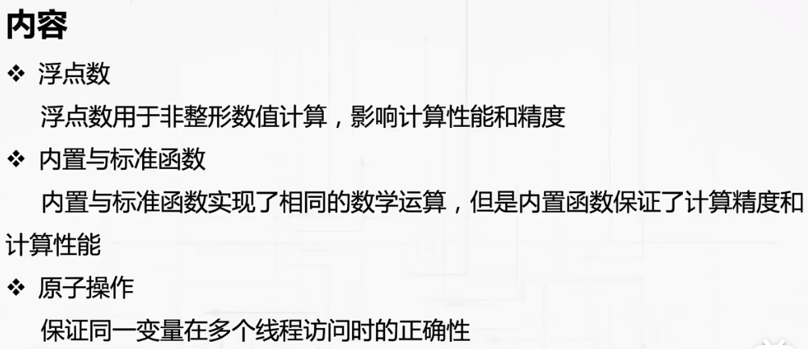

### CAS原子操作

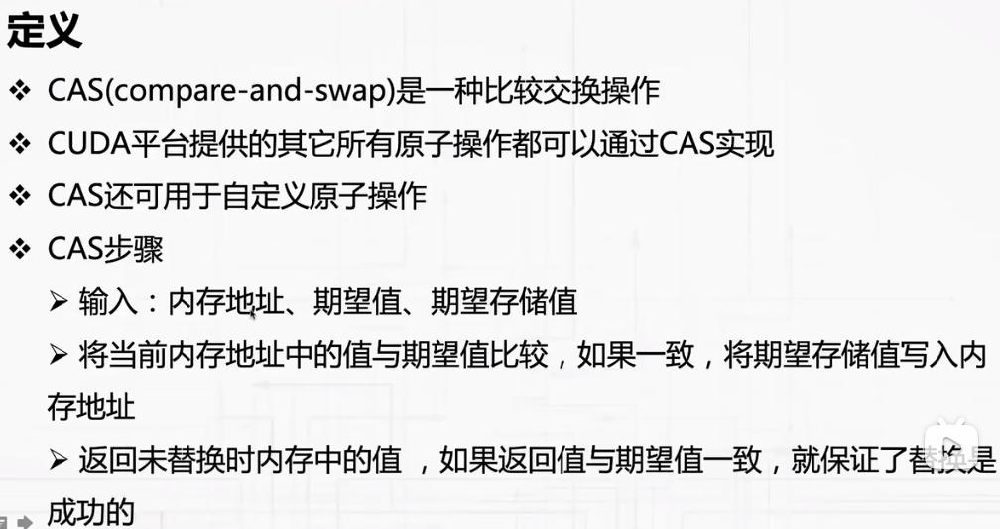

### MAD优化
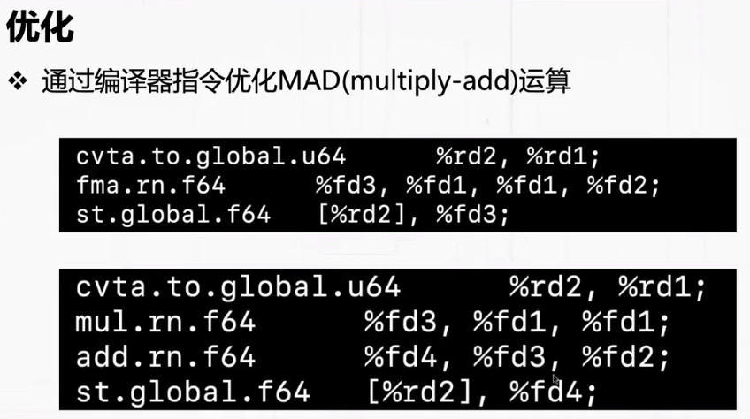


### 原子操作的性能损失


### 内核调试焦点
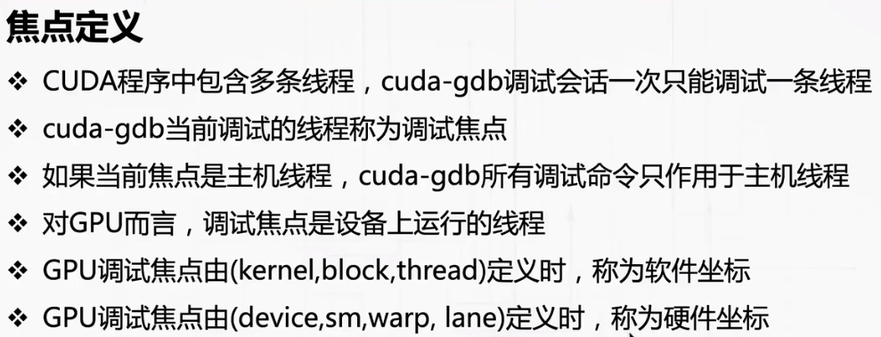


